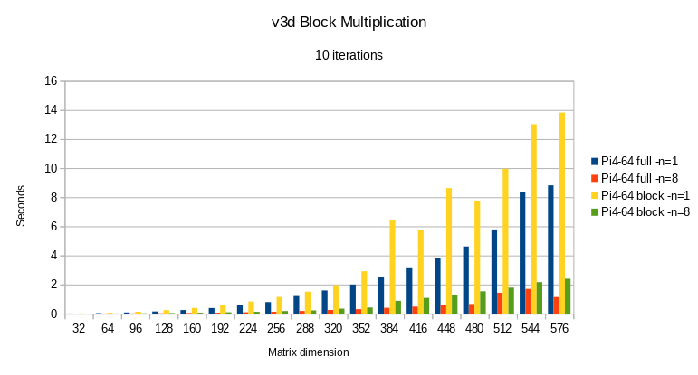

# Profiling Matrix multiplication

|  |  |
|:---:|:---:|
| `vc4` full multiplication | `v4c` block multiplication |

What you see here, is that the performance scales nicely with the number of used QPUs.
This is true for the full matrix calculation as well as the block calculation.

The calculation also scales for `v3d`:

From here on, the profiling times for the maximum number of QPUs will be compared for `v3d` and `vc4`.

Comparing full and block multiplication for `vc4`:

Comparing full and block multiplication for `v3d`:

